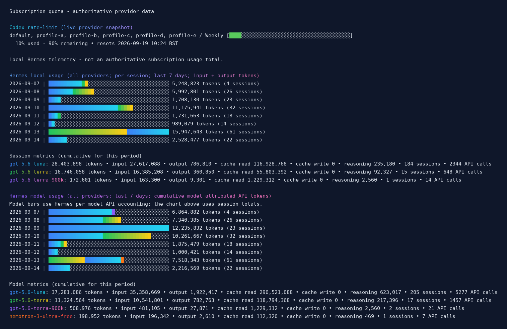

# hermes-codex-usage

A standalone, manually-run CLI for [Hermes Agent](https://github.com/NousResearch/hermes-agent) that reports live OpenAI Codex account limits and local multi-provider usage history.

## See it first

Run `hermes-codex-usage` to see a live Codex rate-limit snapshot alongside the
local Hermes usage history. Charts are the default output, with colour
enabled automatically. The screenshot below shows a representative captured
run; local profile names are anonymised for publication:



The screenshot captures the command's real bold and gradient ANSI output in a
terminal-style image. The Codex percentage and reset information appear on the
line immediately after the bar. Because this is a direct CLI report, it does
not invoke an LLM to compose an answer or consume model tokens, unlike asking
a skill to generate the same report.

## Requirements and installation

- Python 3.10 or newer;
- a working Hermes Agent installation, with its `hermes` launcher available on
  `PATH`;
- an authenticated Hermes `openai-codex` provider for the profiles you want to
  query.

From a checkout:

```bash
python -m venv .venv
.venv/bin/python -m pip install .
hermes-codex-usage --chart
```

The utility does not store credentials. Hermes resolves them from the active
profile's normal credential sources, and the repository deliberately excludes
`.env`, `auth.json`, SQLite databases, session transcripts and runtime logs.

## Usage

```text
hermes-codex-usage
hermes-codex-usage --profile profile-a
hermes-codex-usage --today
hermes-codex-usage --week
hermes-codex-usage --chart
hermes-codex-usage --json
```

With no `--profile`, the command discovers the default Hermes home and every
valid named profile below `profiles/`, then queries each profile independently.
Each query runs in a short-lived Hermes Python subprocess with that profile's
`HERMES_HOME`, so credentials and provider state are resolved afresh on every
execution. It does not run as a daemon, background service, or scheduled job,
and it does not modify Hermes application code.

`--today` shows the charts for today's calendar date only. Hermes
history is filtered by the local calendar date. For Codex, the command checks
the live status now/today; if Codex returns a real `Daily` window, it selects
it. It does **not** invent a calendar-day usage total when that window is
absent: the current API response has only a weekly window, so the command
shows that live window and says so explicitly.
`--week` means "show the weekly allowance" and selects the `Weekly` window when
the provider returns one. If the API does not return a weekly window, the
command says so explicitly. Window labels are derived from the provider's
`limit_window_seconds` field rather than assuming that `primary_window` means
session and `secondary_window` means weekly.

When multiple profiles resolve the exact same authentication token, their
results are collapsed into one block, for example:

```text
Profiles: default, profile-a, profile-b (shared between default, profile-a, profile-b)
```

The token itself and its fingerprint are never printed.

## ASCII charts

`--chart` puts the authoritative provider quota first, followed by a grouped
`Local Hermes telemetry` section. The local data is explicitly labelled as
`Local Hermes telemetry - not an authoritative subscription usage total.`

1. **Codex rate-limit** — a percentage meter for each provider window. The
   whole bar changes smoothly from green at 0% through yellow and orange to red
   at 100% as the quota is consumed. The percentage and reset details are
   printed on the line immediately below the bar.
2. **Local Hermes telemetry** — local Hermes accounting, not the Codex
   subscription quota. It contains two subsections:
   **Hermes local usage** — a historical volume chart covering all providers,
   aggregated per session, with one
   proportional bar per day for `input_tokens + output_tokens`. It uses a
   model-segmented bar when `sessions.model` is available, using the same
   per-model colour convention as the model-usage section. It falls back to a
   blue-to-cyan volume bar when model data is unavailable. The session count is
   shown beside each bar as right-aligned, self-labelled `tokens` and `sessions`
   fields, without an extra header row. A `Session metrics` summary follows the
   chart and reports token, input, output, cache-read, reasoning, API-call and
   session fields stored on `sessions`; records without a model are shown as
   `unknown`. Both `Session metrics` and `Model metrics` use aligned tables with
   one model per row and a dedicated column for each displayed field, ordered by
   total tokens from largest to smallest.
   The default seven-day history is a rolling 168-hour window based on each
   session's `started_at` timestamp, not a fixed set of seven calendar dates.
   The surviving sessions are then grouped by their local calendar date. As a
   result, the oldest visible day can be a partial day and can shrink during
   the day as older sessions fall outside the moving cutoff. For example, a
   run on 8 September in the morning can include more sessions from 1
   September than a run later that afternoon. `--today` is different: it
   selects the current local calendar date.
   **Hermes model usage** — a cumulative model-attributed API-token chart
   covering all providers. Each day's total bar is segmented by model, with a different colour
   gradient for each model. Metric rows use a shared positional colour sequence
   so corresponding rows match visually even when the two accounting sources
   contain different model sets; the section also reports input, output,
   cache-read and reasoning tokens, sessions and API calls.

Colours are enabled by default for `--chart`, including captured output. Use
`--no-color` for plain text logs, or `--color` to make the choice explicit.
The chart headings are bold and use separate gradients on a controlled
dark-navy background. Model segments receive their own gradients. The explicit
background keeps the headings readable on both light and dark terminal themes.

Each section has a distinct meaning: the first is a live provider snapshot, the
second is local session accounting, and the third is local per-model API
accounting. Model-attributed API totals can differ from session totals because
Hermes records those aggregates through different accounting paths. The Codex
chart is not a retroactive quota history.

Model attribution has two sources. `Session metrics` is grouped by the single
model recorded in `sessions.model`; Hermes keeps that value as the session's
initial route, so it can remain unchanged after a mid-session `/model` switch.
`Model metrics` uses the per-call `session_model_usage.model` rows instead and
uses their latest activity timestamp when selecting the rolling window, so a
model used recently in a long-lived session is not silently omitted. The
per-model rows are cumulative counters, so a row that spans the window can
include usage from before its first visible activity; the CLI does not invent
or redistribute attribution that Hermes did not persist.

The executable is installed at `~/.local/bin/hermes-codex-usage`.

When the command is run without a period or output selector, it shows the
complete seven-day/live charts. The chart labels include the percentages,
resets, dates, token totals and session counts, so no separate text report is
printed. `--chart` remains the charts-only form (equivalent to the default
visual output), while `--today` shows only today's charts.
